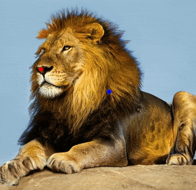
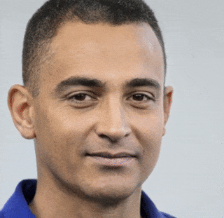

# Drag Your GAN: Interactive Point-based Manipulation on the Generative Image Manifold (Unofficial)

<p float="left">
  
  
  
</p>
                                            
---
                                            
This is an unofficial implementation of the paper ["Drag Your GAN: Interactive Point-based Manipulation on the Generative Image Manifold"](https://arxiv.org/pdf/2305.10973.pdf) by Xingang Pan, Ayush Tewari, Thomas Leimkühler, Lingjie Liu, Abhimitra Meka, and Christian Theobalt. 

The UI is built with the Streamlit framework to run as a web app in your browser. A Colab demo is available to run with a free GPU:

[](https://colab.research.google.com/drive/1E8s9ZMQMlKXcb9KahA-_fCd63HHl4XiH?usp=sharing)


https://github.com/skimai/DragGAN/assets/2939753/d38f89ef-721d-4272-bc47-acd643d47072


## Setup

Follow these steps to run the app in your local environment:

* Install dependencies: `pip install -r requirements.txt`
* Run app: `streamlit run app.py`


## TODO

- [X] Add Colab demo
- [ ] Implement mask reconstruction loss
- [ ] Regularization loss
- [ ] Inversion for real image editing


## Acknowledgments

This project is made possible by these works:

* [StyleGAN2-ADA — Official PyTorch implementation](https://github.com/NVlabs/stylegan2-ada-pytorch)
* [Self-Distilled StyleGAN: Towards Generation from Internet Photos](https://github.com/self-distilled-stylegan/self-distilled-internet-photos)


## Reference

For the complete details about the algorithm please refer to the original paper:

* [Arxiv](https://arxiv.org/abs/2305.10973)
* [Project Page](link-to-project-page)
* [Official Repository](https://github.com/XingangPan/DragGAN)

```
@inproceedings{pan2023draggan,
    title={Drag Your GAN: Interactive Point-based Manipulation on the Generative Image Manifold}, 
    author={Pan, Xingang and Tewari, Ayush, and Leimk{\"u}hler, Thomas and Liu, Lingjie and Meka, Abhimitra and Theobalt, Christian},
    booktitle = {ACM SIGGRAPH 2023 Conference Proceedings},
    year={2023}
}
```
